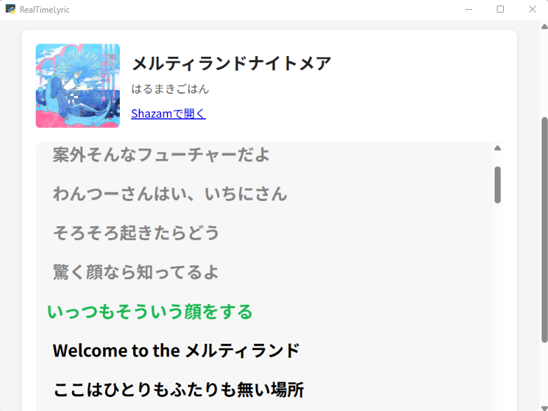

# RealTimeLyric

再生されている音楽の歌詞を表示するアプリ。

PCで再生中の音声をShazamで認識し、[LRCLIB](https://lrclib.net/)から歌詞を取得して、
推定再生位置に合わせてハイライト表示する。



## 動作環境

Windows専用アプリ。以下に依存するため他OSでは動かない。

- Windows 10 / 11
- Microsoft Edge WebView2 Runtime
- インターネット接続(Shazam・LRCLIB・カバー画像の取得に使用)
- WASAPIループバック録音 (`PyAudioWPatch`)
- pywebviewのWindows WebView2バックエンド (`pythonnet` / `clr_loader`)

## セットアップ

```powershell
python -m venv venv
venv\Scripts\pip install -r requirements.txt
```

## 実行方法

```powershell
venv\Scripts\python main.py
```

## ビルド方法(exe化)

PyInstallerでWindows向けの実行ファイル一式を生成する(onedir形式)。

```powershell
venv\Scripts\pip install pyinstaller
venv\Scripts\pyinstaller RealTimeLyric.spec
```

生成物は `dist\RealTimeLyric\` 配下。Windows上でビルドすること。
`RealTimeLyric.exe` 単体ではなく `dist\RealTimeLyric\` フォルダ全体で動作する。

```powershell
dist\RealTimeLyric\RealTimeLyric.exe
```

## 使い方

アプリを起動すると、既定の音声出力デバイスを自動で録音・解析する
「自動認識」がすぐに始まる。止める場合は「自動認識を停止」を押す。

- **自動認識**: PCで再生中の音声を一定間隔で自動録音・解析し、認識できた曲の歌詞を自動表示する
- **音楽ファイルを開く**: mp3ファイルを選択して解析する(複数選択可)。ファイルを再生するものではなく、Shazamでの曲の特定と歌詞取得のみを行う

曲が認識されると、曲名・アーティスト名・ジャケット画像・Shazamへのリンクとともに、
歌詞が画面に表示される。LRCLIBに時間同期済みの歌詞(LRC形式)がある場合は、
推定再生位置に合わせて該当行がハイライトされる(表示位置は録音結果からの推定のため、
実際の再生位置とずれることがある)。

## ライセンス

[MIT License](LICENSE)
